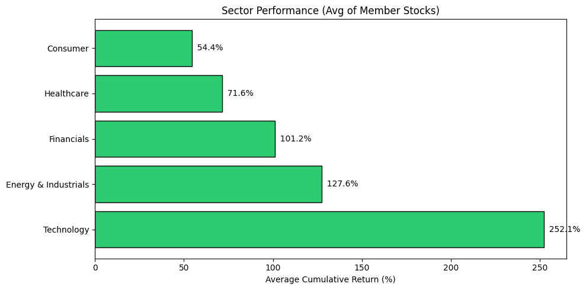
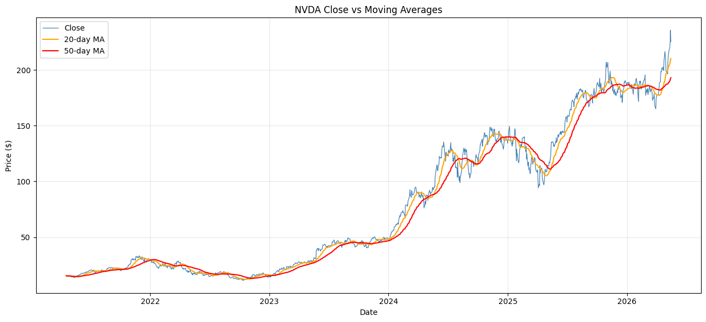
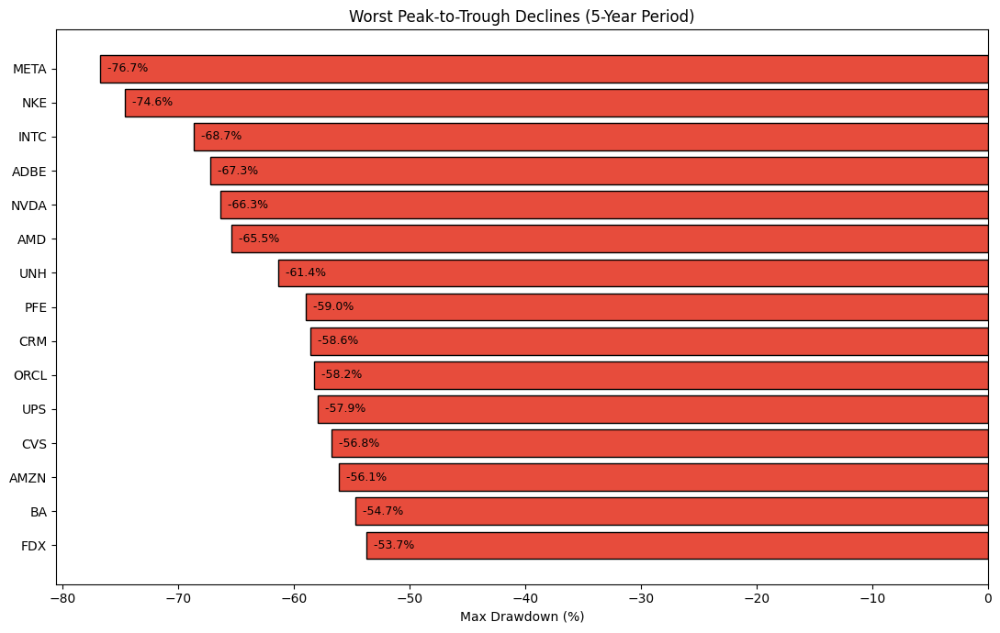
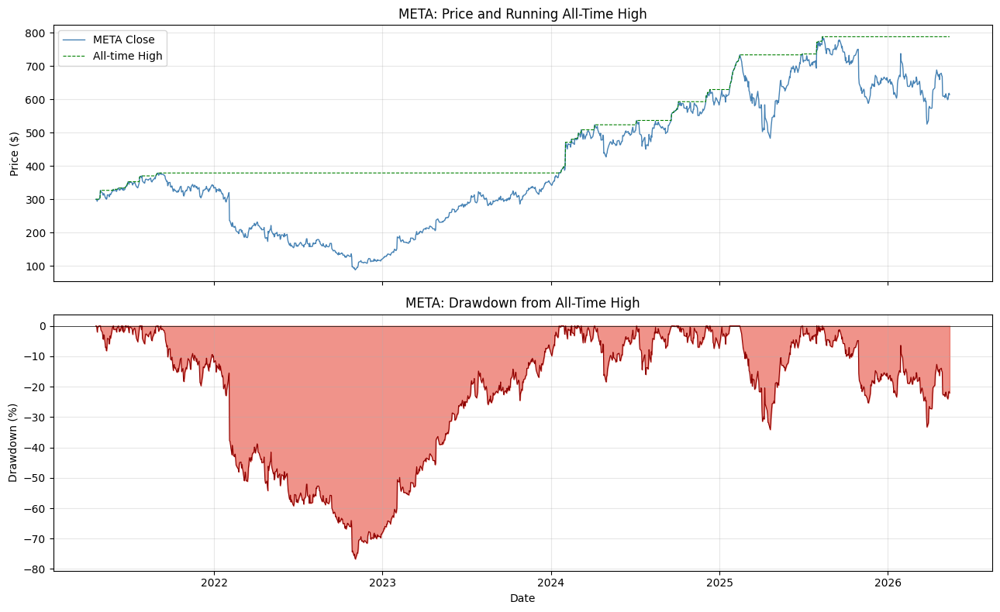
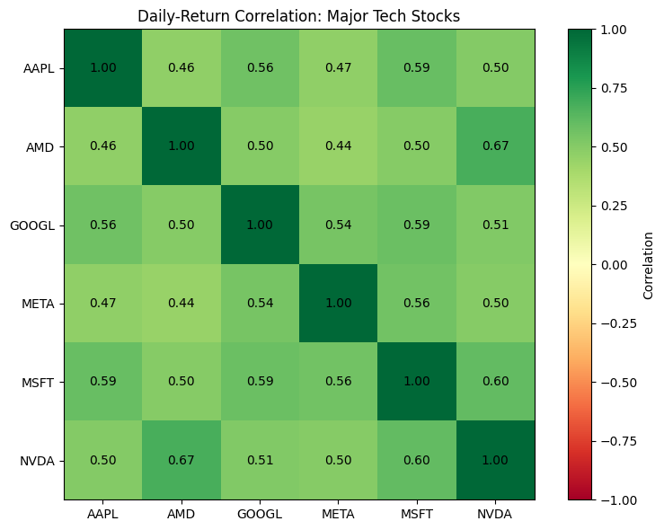

# Stock Data Warehouse

A normalized PostgreSQL data warehouse storing 5 years of daily price and corporate-event data for 50 US equities across 5 sectors. Built with a Python ETL pipeline that fetches data from Yahoo Finance, validates it, and upserts into Postgres with idempotent re-runnability. Includes an analytical Jupyter notebook with 16 progressively complex SQL queries demonstrating window functions, CTEs, and finance-specific computations.

Built with **PostgreSQL · Python · pandas · SQLAlchemy · psycopg2 · yfinance · Jupyter · matplotlib**.

---

## What This Project Demonstrates

- **Database design** — Normalized 3NF schema with reference tables, fact tables, composite primary keys, foreign-key constraints, CHECK constraints, and targeted indexes
- **ETL engineering** — Modular Extract → Transform → Load pipeline with batching, validation, and bulk upsert via `ON CONFLICT DO UPDATE`
- **Analytical SQL** — Window functions (LAG, FIRST_VALUE, MAX OVER, RANK, ROW_NUMBER), CTEs, rolling calculations, and geometric return compounding
- **Finance computation in SQL** — Cumulative returns, drawdowns, rolling moving averages, 52-week highs, cross-sectional volatility, dividend yields

---

## Schema
sectors                         companies
┌──────────────┐                ┌────────────────────┐
│ sector_id PK │◄──── FK ──────│ ticker          PK │
│ sector_name  │                │ company_name       │
└──────────────┘                │ sector_id       FK │
│ market_cap_category│
└────────────────────┘
│
┌─────────────┴────────────┐
▼                          ▼
daily_prices              corporate_events
┌────────────────┐            ┌──────────────┐
│ ticker      FK │            │ event_id  PK │
│ date           │            │ ticker    FK │
│ open           │            │ date         │
│ high           │            │ event_type   │
│ low            │            │ amount       │
│ close          │            └──────────────┘
│ adj_close      │
│ volume         │
│ PK(ticker,date)│
└────────────────┘

**Indexes:** `daily_prices(ticker)`, `daily_prices(date)`, `companies(sector_id)`, `corporate_events(ticker)`.

**Constraints:** `close > 0`, `high >= low`, `volume >= 0`, `event_type IN ('split','dividend')`.

---

## Data

- **50 companies** across 5 sectors (Technology, Financials, Healthcare, Consumer, Energy & Industrials)
- **~63,000 daily price rows** spanning ~5 years
- **~3,000 corporate events** (splits and dividends)
- Source: Yahoo Finance via `yfinance`

---

## Pipeline

1. **Extract** (`src/extract.py`) — Batched yfinance requests with rate limiting; returns long-format DataFrames
2. **Transform** (`src/transform.py`) — Drops malformed rows, fills missing OHL with close, validates constraints, deduplicates on (ticker, date)
3. **Load** (`src/load.py`) — Bulk insert via `psycopg2.extras.execute_values`; upsert via `ON CONFLICT DO UPDATE` so reruns are safe
4. **Orchestrator** (`run_backfill.py`) — Reads ticker list from `companies` table, runs full pipeline, prints diagnostic summary

---

## Analytical Queries

The notebook `notebooks/analytical_queries.ipynb` contains 16 queries organized roughly by complexity.

### Sample: Sector Performance



### Sample: NVDA Price with Moving Averages



### Sample: Maximum Drawdowns



### Sample: META Drawdown Curve



### Sample: Daily-Return Correlation Matrix



### Sample: Market Volatility Over Time


### Full Query List

| # | Query | Key Techniques |
|---|---|---|
| 1 | Universe overview | LEFT JOIN, GROUP BY |
| 2 | Data coverage check | MIN/MAX dates, COUNT |
| 3 | Top 10 cumulative performers | FIRST_VALUE / LAST_VALUE window functions |
| 4 | Sector-level performance | Stacked CTEs, AVG aggregation, visualization |
| 5 | Volume leaders | AVG, MAX aggregation |
| 6 | Biggest single-day moves | LAG window function, NULLIF |
| 7 | Annualized volatility | STDDEV, SQRT(252) annualization |
| 8 | Monthly sector timeline | DATE_TRUNC, geometric compounding via EXP/LN |
| 9 | Rolling 20/50-day MAs | AVG OVER (ROWS BETWEEN) |
| 10 | Max drawdown per stock | Running MAX with UNBOUNDED PRECEDING |
| 11 | Drawdown curve visualization | Same logic, single-ticker time series |
| 12 | Best/worst stock per month | RANK() OVER (PARTITION BY), CASE pivot |
| 13 | Pairwise return correlation | Pivot returns + pandas correlation |
| 14 | Distance from 52-week high | Rolling 252-period MAX, ROW_NUMBER for latest |
| 15 | Market-wide volatility trend | Cross-sectional STDDEV aggregation |
| 16 | Trailing dividend yields | Aggregated corporate events joined to latest prices |

---

## Repo Structure
stock-data-warehouse/
├── sql/
│   ├── 01_schema.sql           # CREATE TABLE statements
│   └── 02_seed_data.sql        # Sectors + 50 companies
├── src/
│   ├── db.py                   # Connection helpers (psycopg2 + SQLAlchemy)
│   ├── extract.py              # yfinance fetching
│   ├── transform.py            # Cleaning and validation
│   └── load.py                 # Bulk upsert into Postgres
├── notebooks/
│   └── analytical_queries.ipynb  # 16 queries with visualizations
├── results/                    # Chart PNGs
├── run_backfill.py             # Pipeline orchestrator
├── requirements.txt
├── .env.example
└── README.md

---

## How to Run

### Prerequisites
- PostgreSQL 14+ installed locally
- Python 3.11+

### Setup

```bash
git clone https://github.com/Mihirr04/stock-data-warehouse.git
cd stock-data-warehouse

# Create venv and install deps
python -m venv .venv
.\.venv\Scripts\Activate.ps1   # Windows
# source .venv/bin/activate     # macOS/Linux
pip install -r requirements.txt

# Configure database credentials
cp .env.example .env
# Edit .env with your Postgres password

# Create database (in psql)
CREATE DATABASE stock_warehouse;
\c stock_warehouse
\i sql/01_schema.sql
\i sql/02_seed_data.sql

# Run the backfill (5–8 minutes)
python run_backfill.py

# Open the analytical notebook
jupyter notebook notebooks/analytical_queries.ipynb
```

---

## Limitations

A few honest caveats:

1. **Free-tier data source.** Yahoo Finance via `yfinance` is unofficial and occasionally returns incomplete data for thinly-traded tickers. Production systems use paid feeds (Bloomberg, Refinitiv, Polygon).
2. **No intraday granularity.** Daily OHLCV only. Real quant work often requires minute or tick-level data.
3. **Single-market scope.** US equities only. Cross-market analysis would require additional data sources and currency handling.
4. **No survivorship bias correction.** The current ticker list is forward-looking — it doesn't include delisted companies, which biases historical performance metrics upward.
5. **Trailing dividend yield is unannualized.** The yield metric in Query 16 sums all dividends paid during the data period rather than annualizing — accurate for ranking but not directly comparable to published yields.
6. **No support for stock splits in historical close.** Raw `close` is post-split; `adj_close` is split- and dividend-adjusted. Queries that need pre-split prices would require additional joins to `corporate_events`.

---

## Future Work

- **Incremental daily updates.** A `run_daily.py` companion to backfill that fetches only the latest trading day, enabling cron-scheduled refreshes.
- **Expanded universe.** Add ETFs, international ADRs, and historical delisted tickers for survivorship-bias correction.
- **Materialized views.** Pre-compute expensive metrics (daily returns, rolling volatility) as materialized views for sub-second query latency.
- **dbt integration.** Replace the hand-rolled transform layer with dbt models for testability and lineage tracking.
- **Streamlit dashboard.** A thin web UI on top of the database for interactive exploration of the underlying analytics.

---

## Author

Mihir Shinde — [GitHub](https://github.com/Mihirr04)